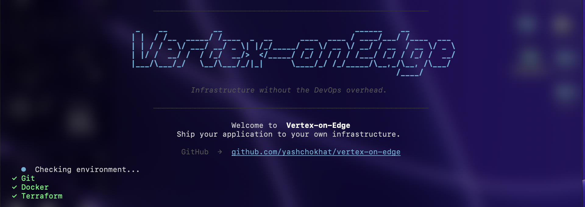
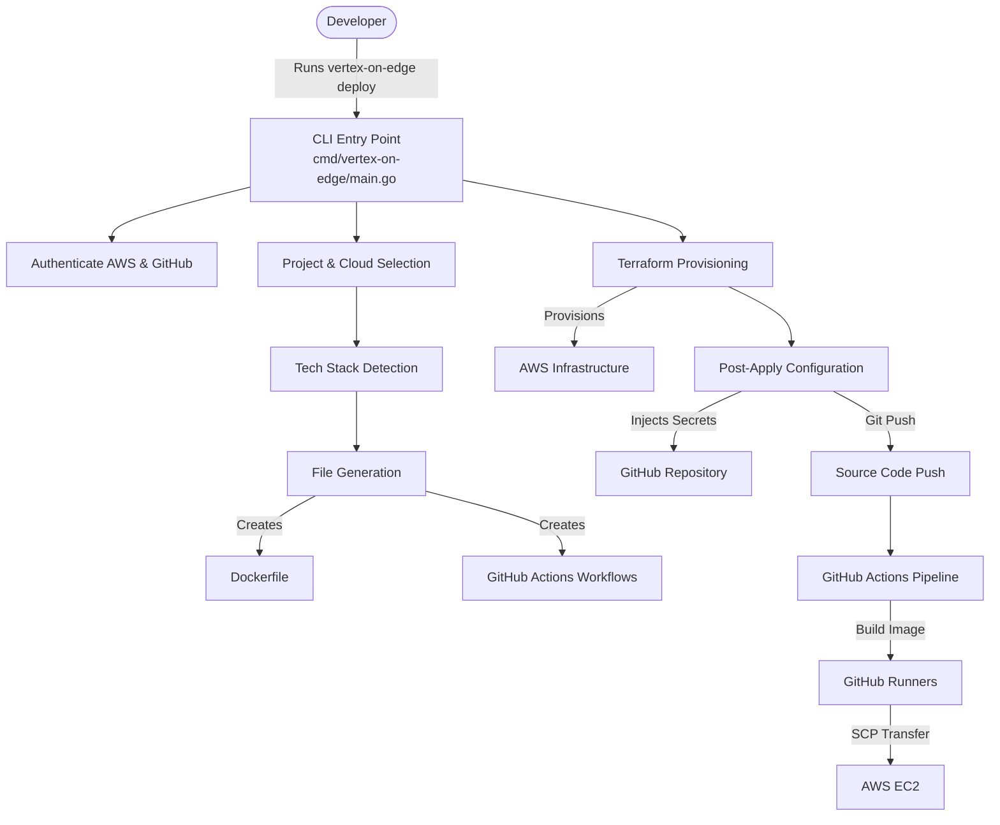
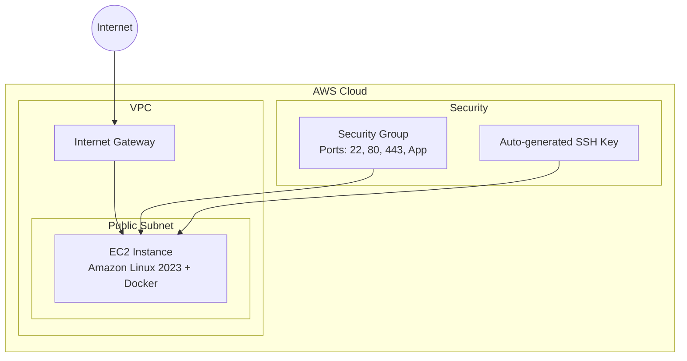
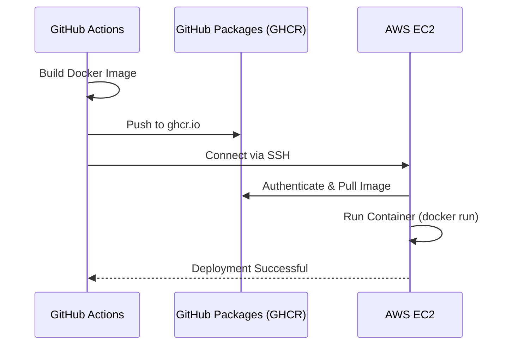

# Vertex-on-Edge

[](https://gitdiagram.com/yashchokhat/vertex-on-edge-cli?utm_source=readme&utm_medium=picture)

Vertex-on-Edge is a Go-based command-line interface that automates the transition from a local project directory to a fully deployed cloud application.



## What It Does

Vertex-on-Edge takes a developer's project directory and automates the entire deployment pipeline. It scans the directory to detect the technology stack, generates a production-ready Dockerfile, creates GitHub Actions CI/CD workflows, and provisions cloud infrastructure using Terraform. Finally, it pushes the project to GitHub with the necessary SSH secrets, resulting in an automated pipeline that builds your application, pushes it to GitHub's free Container Registry (GHCR), and securely deploys it to your EC2 instance over SSH, completely skipping expensive AWS container registries and strict IAM boundaries.

## System Architecture



## AWS Infrastructure Architecture



## Registry-less Deployment Flow



## Project Structure

```text
cmd/vertex-on-edge/main.go         -- Entry point
internal/
  cli/                              -- Cobra commands (deploy, init, destroy, status, logs, version)
    deploy.go                       -- Main deployment orchestrator
    reconcile.go                    -- Import existing AWS resources into Terraform state
  auth/aws/auth.go                  -- AWS authentication (sts get-caller-identity, aws configure)
  auth/github/auth.go               -- GitHub authentication (gh auth status, gh auth login)
  config/config.go                  -- Version, constants, supported stacks list
  dependencies/installer.go         -- Auto-install terraform, aws, gh via brew/apt/winget/choco
  detector/                         -- Rule-based tech stack detection
    detector.go                     -- Detection engine
    rules.go                        -- Detection rules for 20+ frameworks
    types.go                        -- Rule and Detector interfaces
    filesystem.go                   -- File scanning, package.json parsing
  docker/generator.go               -- Dockerfile generation for Next.js, React, Vue, Angular, Node.js, etc.
  github/
    actions.go                      -- GitHub Actions workflow generation (deploy.yml, test.yml)
    repo.go                         -- Git init, GitHub repo creation, secrets injection, push
    ssh.go                          -- GitHub SSH host key verification
  platform/
    provider.go                     -- Cloud provider types (AWS, GCP, Azure)
    target.go                       -- Deployment targets (EC2, ECS, Cloud Run, Container Apps, etc.)
    config.go                       -- Detect existing .vertex-on-edge config in a project
  terraform/
    runner.go                       -- Terraform CLI wrapper (init, validate, plan, apply, destroy, output, import, state list)
    renderer.go                     -- Copy embedded .tf templates + generate terraform.tfvars
    aws/ec2/
      embed.go                      -- go:embed for .tf files
      main.tf                       -- AWS infrastructure definition
      variables.tf                  -- Terraform variable definitions
      outputs.tf                    -- Terraform output definitions
  ui/                               -- Terminal UI (banner, prompts, spinners, animations)
pkg/models/stack.go                 -- Data types (ProjectInfo, DetectedStack, Confidence)
bin/                                -- Compiled binaries (macOS, Linux, Windows)
Snapshot/CLI.png                    -- CLI screenshot
```

## Supported Stacks

The CLI automatically detects and configures deployments for the following frameworks:
Next.js, React, Vue, Angular, Svelte/SvelteKit, Nuxt, Remix, NestJS, Express.js, Node.js, Django, FastAPI, Flask, Python, Go, Spring Boot, Java, Rust, Laravel, PHP, Ruby on Rails, Ruby, Flutter, React Native, Capacitor, Android Native, iOS Native.

## Prerequisites

- Go 1.21+ (for building from source)
- Git
- Docker
- Terraform (auto-installable by the CLI)
- AWS CLI (auto-installable by the CLI)
- GitHub CLI (auto-installable by the CLI)

## Installation

To install from source:

```bash
git clone https://github.com/yashchokhat/vertex-on-edge.git
cd vertex-on-edge
make build
./bin/vertex-on-edge deploy
```

Alternatively, you can download pre-built binaries from the `bin/` directory.

## Usage

```bash
# Full interactive deployment
vertex-on-edge deploy

# Initialize detection only
vertex-on-edge init

# Destroy infrastructure
vertex-on-edge destroy

# Check status
vertex-on-edge status

# View logs
vertex-on-edge logs

# View version
vertex-on-edge version
```

## How It Works

When you run the `deploy` command, the CLI performs the following steps:

1. **Environment Check**: Verifies that Git, Docker, and Terraform are installed, offering to auto-install any missing dependencies.
2. **Authentication**: Authenticates with GitHub and AWS to ensure necessary permissions.
3. **Project Selection**: Prompts the user to select the target directory.
4. **Stack Detection**: Analyzes the project files to determine the technology stack.
5. **Infrastructure Prompts**: Collects preferences for cloud provider, region, networking, and deployment targets.
6. **File Generation**: Creates the appropriate `Dockerfile` and GitHub Actions workflows (`deploy.yml`, `test.yml`).
7. **Provisioning**: Runs Terraform to provision the required cloud infrastructure (EC2, Security Groups) and auto-generates a secure SSH key pair.
8. **Secrets Management**: Injects the necessary infrastructure details (EC2 Public IP, SSH Private Key) into the GitHub repository as secrets.
9. **Code Push**: Initializes the Git repository (if needed) and pushes the code, which triggers the CI/CD pipeline. The pipeline builds the image on GitHub, pushes it to `ghcr.io`, and uses SSH to pull and run the container directly on EC2, entirely skipping AWS ECR and IAM constraints.

## Configuration

The CLI stores project-specific configuration and Terraform state in a `.vertex-on-edge` directory within your project root. This directory tracks the infrastructure state and deployment settings, allowing the CLI to manage updates and tear down resources cleanly. Ensure this directory is added to your `.gitignore` if you are managing Terraform state remotely, or keep it secure if local.

## Troubleshooting

### SSH Authentication Error
If the GitHub Actions workflow fails during the SSH command execution:
- Verify that your EC2 Security Group allows inbound traffic on Port 22 from GitHub Actions. By default, the CLI opens port 22 globally (`0.0.0.0/0`) for this purpose.
- Check that the `EC2_SSH_KEY` secret in your repository matches the private key output from Terraform.
- Ensure the `EC2_HOST` matches the current public IP of your instance.

### Missing Dependencies
If the auto-installer fails to install required tools, manually install Git, Docker, Terraform, AWS CLI, or GitHub CLI using your system's package manager.

## Contributing

Contributions are welcome. Please submit pull requests with clear descriptions of the changes. Ensure your code passes existing tests and adheres to the project's formatting standards.

## License

This project is licensed under the terms specified in the LICENSE file.